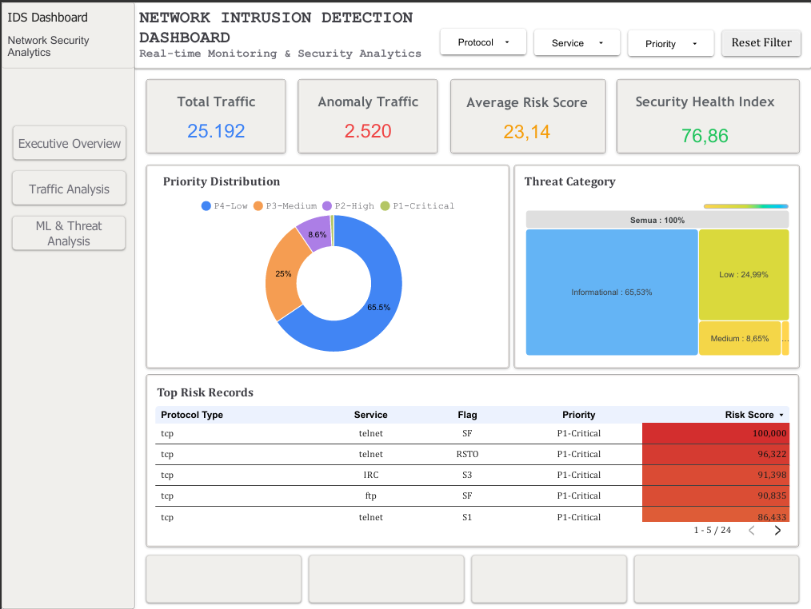
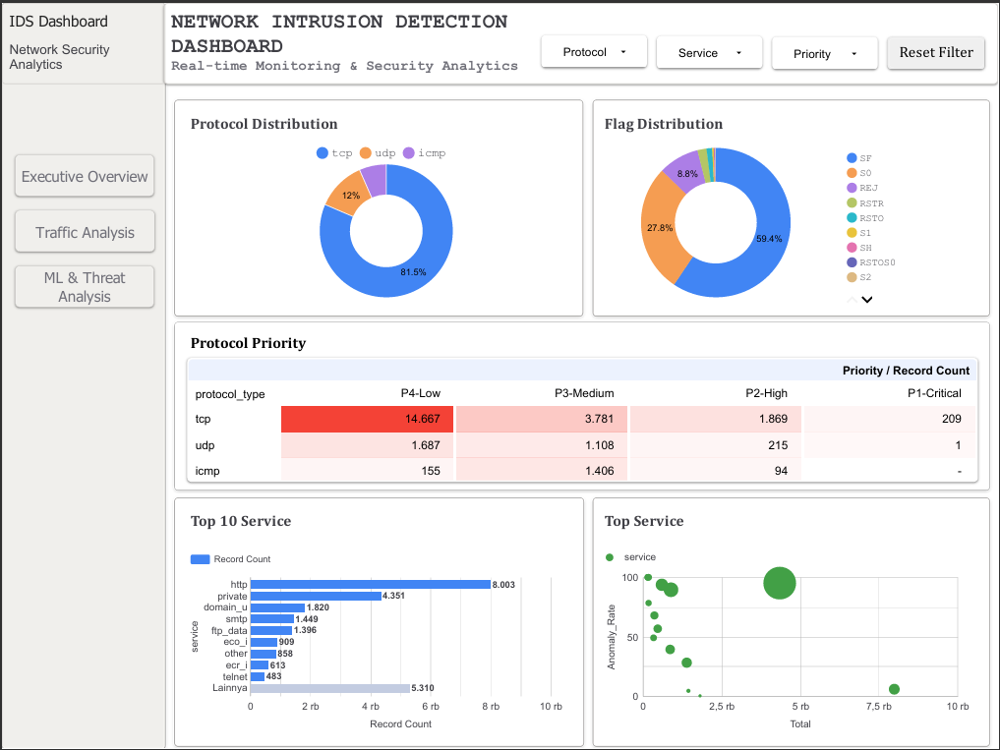
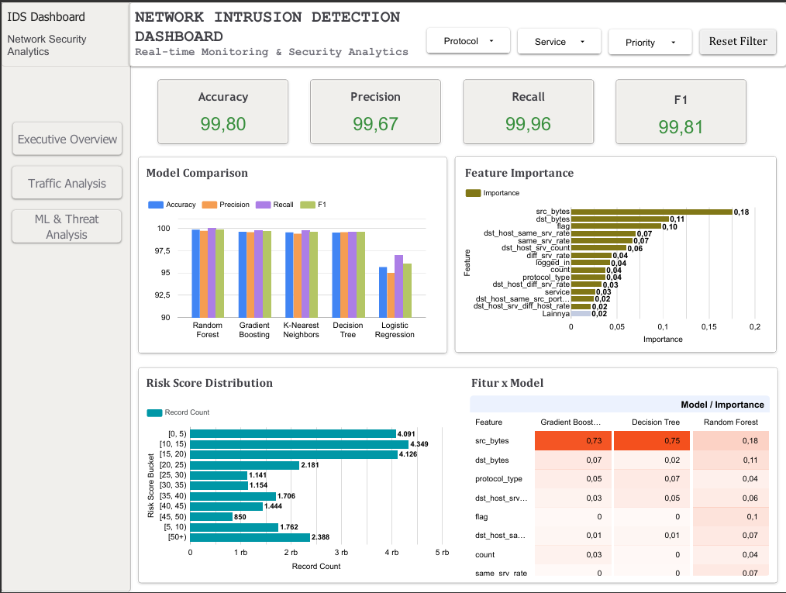

# Network Intrusion Detection System

Machine-learning pipeline and analytics dashboard for detecting anomalous network traffic on the **NSL-KDD** dataset — five supervised classifiers benchmarked head-to-head, an unsupervised **Isolation Forest** risk-scoring layer on top, and a full BI dashboard (Looker Studio + a dependency-free offline clone) built on the results.

<p align="left">
  
  
  
  
</p>

---

## Overview

This project trains and compares classical ML models to flag malicious network connections in the NSL-KDD intrusion-detection benchmark, then layers an unsupervised anomaly detector on top to produce a continuous **0–100 risk score** for every record — the basis for a security-analytics dashboard aimed at a SOC-style "Executive Overview → Traffic Analysis → ML & Threat Analysis" workflow.

|                 |                                                                               |
| --------------- | ----------------------------------------------------------------------------- |
| **Dataset**     | NSL-KDD (Train: 25,192 rows · Test: 22,544 rows · 41 features)                |
| **Task**        | Binary classification (`normal` vs `anomaly`) + unsupervised risk scoring     |
| **Best model**  | Random Forest — **99.80%** accuracy, **99.81%** F1                            |
| **Risk engine** | Isolation Forest (`contamination=0.10`) → 0–100 risk score → 4-tier priority  |
| **Dashboard**   | Looker Studio report + a static HTML/JS clone that needs no server or account |

## Results

**Model comparison** (held-out 20% validation split, `random_state=42`):

| Model                |   Accuracy |  Precision |     Recall |         F1 |
| -------------------- | ---------: | ---------: | ---------: | ---------: |
| **Random Forest** ⭐ | **99.80%** | **99.67%** | **99.96%** | **99.81%** |
| Gradient Boosting    |     99.56% |     99.52% |     99.67% |     99.59% |
| K-Nearest Neighbors  |     99.48% |     99.33% |     99.70% |     99.52% |
| Decision Tree        |     99.46% |     99.52% |     99.48% |     99.50% |
| Logistic Regression  |     95.61% |     94.94% |     96.95% |     95.94% |

**Top predictive features** (Random Forest importance): `src_bytes` (0.176), `dst_bytes` (0.106), `flag` (0.098), `dst_host_same_srv_rate` (0.070), `same_srv_rate` (0.067) — byte volume and service-repetition patterns dominate, consistent with how DoS/probe attacks in NSL-KDD behave.

**Risk & priority distribution** across all 25,192 records (Isolation Forest):

| Priority      | Records | Share |
| ------------- | ------: | ----: |
| P4 – Low      |  16,509 | 65.5% |
| P3 – Medium   |   6,295 | 25.0% |
| P2 – High     |   2,178 |  8.6% |
| P1 – Critical |     210 |  0.8% |

Mean risk score **23.14** / 100 → **Security Health Index 76.86**.

## Dashboard

The live Looker Studio report is mirrored by a dependency-free clone in [`looker-clone/`](looker-clone/) — open `looker-clone/index.html` directly in a browser, no server or Google account required. All numbers below come from the actual trained pipeline, not mock data.

<table>
<tr><td><b>Executive Overview</b></td></tr>
<tr><td></td></tr>
<tr><td><b>Traffic Analysis</b></td></tr>
<tr><td></td></tr>
<tr><td><b>ML &amp; Threat Analysis</b></td></tr>
<tr><td></td></tr>
</table>

## Pipeline

```
Train_data.csv / Test_data.csv
          │
          ▼
  Label-encode categoricals (fit on train+test union → no unseen-label errors)
  Encode target: normal / anomaly
  Stratified 80/20 split, one shared StandardScaler
          │
          ├──▶ 5 classifiers (LogReg, Decision Tree, KNN, Random Forest, Gradient Boosting)
          │        → accuracy / precision / recall / F1 per model
          │
          └──▶ Isolation Forest (contamination = 0.10) on the full scaled set
                   → anomaly_score → risk_score (0–100) → ThreatCategory / Priority
          │
          ▼
  dashboard_dataset.csv, security_intelligence.csv, model_performance.csv,
  feature_importance.csv, top_risk_records.csv, dashboard_summary.csv, …
          │
          ▼
     Looker Studio report  ⇄  looker-clone/ (offline HTML/JS mirror)
```

## Repository structure

```
.
├── Code Notebook.ipynb          # full pipeline: EDA → preprocessing → 5 models → Isolation Forest → exports
├── data/raw/                    # NSL-KDD source data
│   ├── Train_data.csv
│   └── Test_data.csv
├── looker-clone/                # offline dashboard — open index.html, no server needed
│   ├── index.html
│   ├── assets/                  # css/js (rendering engine + app logic)
│   ├── data/                    # aggregated CSVs the dashboard reads
│   ├── exports/                 # full pipeline output (46-col dataset, model scores, importances…)
│   └── tools/
│       ├── run_notebook_pipeline.py   # runs the notebook's ML steps headlessly on data/raw/
│       └── build_data.py              # aggregates pipeline output into the dashboard's data.js
├── reports/                     # final report PDF/PPTX, published dashboard PDF exports
└── docs/screenshots/            # dashboard screenshots used in this README
```

## Reproducing the results

```bash
pip install pandas numpy scikit-learn matplotlib seaborn

# 1. Run the full ML pipeline headlessly (same steps as the notebook)
cd looker-clone/tools
python run_notebook_pipeline.py --data-dir ../../data/raw --out ../exports

# 2. Rebuild the dashboard's data feed from those exports
python build_data.py --from-csv ../exports

# 3. Open looker-clone/index.html in a browser
```

Or open `Code Notebook.ipynb` directly (Jupyter / Google Colab) to walk through EDA, preprocessing, model training, and the Isolation Forest risk-scoring step interactively.

## Tech stack

`pandas` · `numpy` · `scikit-learn` (Logistic Regression, Decision Tree, KNN, Random Forest, Gradient Boosting, Isolation Forest) · `matplotlib` / `seaborn` for EDA · Looker Studio for the published report · vanilla HTML/CSS/JS for the offline dashboard clone (no build step, no framework).

## License

[MIT](LICENSE)
